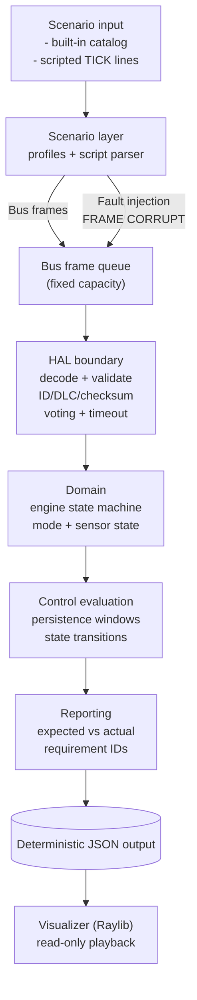
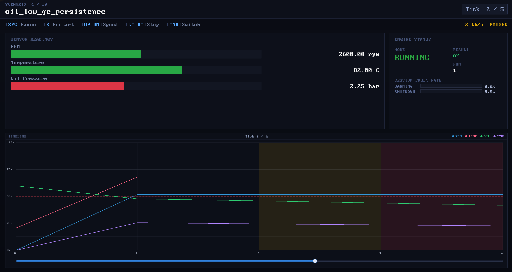

# Engine Control Validation & HIL Test Rig Simulator

Deterministic C11 engine-control validation simulator implementing tick-stepped execution, structured fault injection, requirement-tagged reporting, and CI-enforced verification.

> [!IMPORTANT]
> This project models validation workflows and produces reviewable artifacts. It is not a production ECU.

## Engineering signals

| Signal | Measured value | How it is verified |
|---|---:|---|
| Unit tests | 255 | `make test-unit` |
| Line coverage (unit-tested modules) | 100% (1355/1355 measured lines) | `make coverage` |
| Built-in validation scenarios | 10 | `./build/testrig --run-all` |
| Scripted scenario files | 9 | `scenarios/*.txt` |
| Determinism replay | SHA-256 match across two identical runs | `make determinism-check` |
| Quality gate | `make ci-check` | build + analysis + tests + replay |
| CI compilers | clang + gcc | `.github/workflows/ci.yml` matrix |

## Architecture (high level)



## Problem

Engine control software must detect unsafe conditions and transition to a safe state without false triggers from transient noise.

- Faults modeled: over-temperature, low oil pressure, combined high-load warnings, corrupt/missing bus frames, and sensor disagreement.
- Requirement shape: multi-tick persistence windows (fault must persist for $N$ consecutive ticks before escalation).
- Determinism requirement: identical inputs must yield identical outputs so validation artifacts remain reproducible across CI runs and platforms.

## Context

Industrial validation commonly progresses from deterministic simulation to bench testing:

- **SIL-style simulation** to stabilize control logic and corner cases before hardware is available.
- **HIL (hardware-in-the-loop)** to validate interactions with real I/O timing and bus behavior on a test rig.

Simulation is the low-cost stage where fault injection, traceability, and repeatability can be pushed hardest.

## Solution

### Determinism and reproducibility

- Tick counter replaces wall-clock time.
- Single-threaded execution.
- No dynamic memory allocation (no `malloc`/`free`).
- JSON output is treated as a stable contract (`schema_version` and a schema file under `schema/`).

### Module separation

Strict layering keeps the deterministic core insulated from I/O and visualization:

```
src/
  app/        CLI orchestration
  domain/     engine state machine + control logic
  platform/   HAL boundary and bus/frame validation
  scenario/   scenario catalog + script parser
  reporting/  deterministic JSON + console reporting
include/      public interfaces
```

Layer boundaries are enforced by `make analyze-layering`.

### Simulation loop

Each tick executes a fixed, reviewable sequence:

1. Ingest one bus frame (or detect timeout).
2. HAL validates/decodes the frame (ID/DLC/checksum, voting, watchdog rules).
3. Domain updates engine state and evaluates control logic.
4. Reporting appends deterministic JSON for the tick.

### Fault injection

Script directives inject bad frames through the same validation path as normal frames:

```text
TICK 5 FRAME CORRUPT
```

This exercises checksum rejection paths and “no valid sample” timeouts without special test hooks inside the domain layer.

## Validation

Correctness is verified as multiple independent signals:

- Unit tests: `make test-unit` (255 tests).
- Integration suite: `./build/testrig --run-all` runs 10 requirement-tagged scenarios.
- Fault injection: `FRAME CORRUPT` and strict script validation exercise error paths.
- Contract validation: JSON output is validated against `schema/engine_test_rig.schema.json` (`make validate-json`).
- Deterministic replay: two identical `--run-all` runs must hash-identically (`make determinism-check`).
- Runtime checking: ASan/UBSan runs the full scenario suite (`make analyze-sanitizers`).
- Static analysis: `cppcheck`, `clang-tidy`, MISRA C:2012 (cppcheck addon) (`make analyze*`).

## Results

- Unit tests: 255/255 pass.
- Validation scenarios: 10/10 pass with requirement IDs attached to each scenario result.
- Coverage: 100% line coverage on unit-tested modules (1355/1355 measured lines). Integration/orchestration files (`test_runner`, `scenario_profiles`, `scenario_report`, `scenario_catalog`, `output`) are exercised by `make test-all` integration runs, not by the unit-test coverage gate.
- `make ci-check` gates on: compiler warnings-as-errors, static analysis, MISRA addon analysis, layering enforcement, sanitizers, unit + integration runs, JSON contract checks, coverage, deterministic replay, schema compatibility, and a visualization boundary audit.

## Lessons

- Deterministic replay shifts debugging from “reproduce on my machine” to byte-for-byte diffs.
- Persistence windows reduce false positives but require explicit boundary validation (recovery resets, off-by-one ticks).
- Layering is easiest to maintain when CI treats boundary violations as build failures.
- Treating JSON as a contract enables independent tooling (CI gating, visualization) without coupling to internal state.

## Industrial relevance

This mirrors pre-hardware validation workflows without claiming production equivalence.

- Provides SIL-style repeatable inputs/outputs suitable for regression gating.
- Requirement-tagged results are shaped to integrate with requirements tracking (linking scenario IDs to external requirement records).
- A direct extension path to HIL is swapping the simulated bus transport with real I/O while keeping domain/control behavior unchanged.

## Design constraints

- Deterministic execution: no threads, no wall-clock dependencies, no randomness.
- Explicit state transitions: all mode changes occur through the domain state machine.
- Fixed-capacity data structures and bounded loops.
- CI must pass before merge: correctness signals are automated and enforced.
- Static analysis and MISRA checks treated as build-time constraints.

## Build and run

### Prerequisites

| Tool | Purpose |
|---|---|
| `clang` or `gcc` | C11 compiler |
| `make` | build orchestration |
| `cppcheck` | static analysis + MISRA addon |
| `clang-tidy` | additional static analysis |
| `llvm-cov` + `lcov` | coverage collection + HTML report |
| `valgrind` | deep runtime memory validation |
| `python3` | JSON schema validation |

On Debian/Ubuntu:

```bash
sudo apt install clang llvm make git cppcheck clang-tidy python3 lcov valgrind libc6-dbg
```

### Quick start

```bash
make
make test-unit
./build/testrig --run-all
make ci-check
```


## JSON Machine Output

Per-scenario JSON includes:

- Top-level contract metadata (`schema_version`, `software_version`, `build_commit`)
- Tick-level sensor inputs, control output, and engine mode
- Requirement traceability ID (`requirement_id`)
- Scenario expected vs actual outcome with pass/fail status

Formal schema: `schema/engine_test_rig.schema.json`

Expected CLI behavior:

- Exit code `0` for a passing scenario
- JSON envelope includes `schema_version`, `software_version`, `build_commit`, `scenarios`, and `summary`
- On failure paths, JSON includes `error` with `code`, `module`, `function`, `tick`, `severity`, and `recoverability`


## Raylib Visualization (Read-Only)



The visualization program reads JSON output only - it cannot call simulator internals or modify simulation state.

Features:

- Animated dashboard playback with timeline graphs
- Threshold overlays and scrubbable tick slider
- Multi-scenario switching with cumulative statistics


## Module API Overview

Primary public interfaces are intentionally narrow and defined under `include/`:

| Header | Key Functions | Purpose |
|--------|--------------|---------|
| `hal.h` | `hal_ingest_sensor_frame()`, `hal_read_sensors()`, `hal_receive_bus()`, `hal_transmit_bus()`, `hal_vote_sensors()`, `hal_watchdog_check()` | Deterministic sensor transport, bus I/O, sensor voting, watchdog, structured diagnostics |
| `control.h` | `evaluate_engine()`, `compute_control_output()`, `control_configure_calibration()` | Persistence-threshold safety rules, actuator demand, calibration |
| `engine.h` | `engine_start()`, `engine_update()`, `engine_transition_mode()` | State machine transitions, physics update |
| `script_parser.h` | `script_parser_parse_file()` | Scenario script validation and tick/frame emission |
| `config.h` | `config_load_calibration_file()`, `config_load_physics_file()` | JSON calibration and physics configuration loading |
| `test_runner.h` | `run_all_tests()`, `run_scripted_scenario_with_json()` | Scenario orchestration and JSON/console entry points |


## Hardware Abstraction Layer

HAL interfaces are defined in `include/hal.h` and implemented in `src/platform/hal.c`.

- `hal_init()` / `hal_shutdown()` - HAL lifecycle management
- `hal_ingest_sensor_frame()` - deterministic transport frame ingestion
- `hal_read_sensors()` - frame payload decode with timeout detection
- `hal_apply_sensors()` - validated sensor-to-engine state boundary
- `hal_receive_bus()` / `hal_transmit_bus()` - deterministic bus interfaces
- `hal_write_actuators()` - control egress boundary
- `hal_submit_redundant_temp()` / `hal_vote_sensors()` - dual-channel sensor voting

`BusFrame` is ABI-hardened: `_Static_assert(sizeof(BusFrame) == 13, "Unexpected frame size");`


## Requirement Traceability

Scenario `requirement_id` values emitted in JSON are defined in `src/scenario/requirements.h` and attached to test
registry entries.

Console output includes requirement linkage per test:

```
REQ-ENG-002 | oil_low_ge_persistence | expected=SHUTDOWN | actual=SHUTDOWN | PASS
```

JSON output includes `"requirement_id": "REQ-ENG-002"` per scenario.

Full requirement-to-test mapping: `docs/requirements_traceability_matrix.md`


## Error Handling Model

`include/status.h` defines the unified status model:

| Status | Severity | Recoverability |
|--------|----------|----------------|
| `STATUS_OK` | `SEVERITY_INFO` | - |
| `STATUS_INVALID_ARGUMENT` | `SEVERITY_ERROR` | `RECOVERABLE` |
| `STATUS_PARSE_ERROR` | `SEVERITY_ERROR` | `RECOVERABLE` |
| `STATUS_IO_ERROR` | `SEVERITY_ERROR` | `NON_RECOVERABLE` |
| `STATUS_TIMEOUT` | `SEVERITY_FATAL` | `RECOVERABLE` |
| `STATUS_BUFFER_OVERFLOW` | `SEVERITY_WARNING` | `RECOVERABLE` |
| `STATUS_INTERNAL_ERROR` | `SEVERITY_FATAL` | `NON_RECOVERABLE` |

All paths use explicit status returns with no silent fallthrough.
Strict mode is available via `--strict`.


## Calibration Configuration

Threshold calibration can be loaded at startup:

```bash
./build/testrig --run-all --config calibration.json
```

Supported keys: `temperature_limit`, `oil_pressure_limit`, `persistence_ticks`, `combined_warning_persistence_ticks` (optional)

Schema: `schema/calibration.schema.json`. Configuration is parsed once at startup
and cannot be mutated during runtime. If `--config` is omitted, deterministic defaults are used.


## Quality Gates

`make ci-check` is the baseline quality gate. It fails if any of the following fail:

| Gate | Command | Threshold |
|------|---------|-----------|
| Compiler | `make all` | Zero warnings (`-Werror`) |
| cppcheck | `make analyze-cppcheck` | Zero findings |
| clang-tidy | `make analyze-clang-tidy` | Zero findings |
| MISRA C:2012 | `make analyze-misra` | Only pre-approved suppressions |
| Layering | `make analyze-layering` | No dependency violations |
| Sanitizers | `make analyze-sanitizers` | No ASan/UBSan findings |
| Valgrind (local deep check) | `make analyze-valgrind` | No leaks or invalid memory accesses |
| Unit tests | `make test-unit` | 255/255 pass |
| Integration | `make test-all` | All scenarios pass |
| JSON contract | `make validate-json` | Schema-valid output |
| Schema compatibility | `make validate-schema-compat` | Required fields present |
| Determinism replay | `make determinism-check` | SHA-256 match |
| Viz boundary audit | `make check-viz-boundary` | JSON-only boundary |
| Coverage | `make coverage` | ≥80% line coverage on unit-tested modules (currently 100%, 1355/1355 measured lines) |
| Coverage HTML | `make coverage-html` | Browsable HTML report in `coverage/html/` |


## CLI Reference

```
Usage:
  Global options: [--config calibration.json] [--log-level DEBUG|INFO|WARN|ERROR]

  ./build/testrig --run-all [--show-sim] [--show-control] [--show-state] [--color] [--json] [--strict]
  ./build/testrig --scenario <name> [--show-sim] [--show-control] [--show-state] [--color] [--json] [--strict]
  ./build/testrig --script <path> [--show-sim] [--show-control] [--show-state] [--color] [--json] [--strict]
```

| Flag | Description |
|------|-------------|
| `--run-all` | Execute all built-in validation scenarios |
| `--scenario <name>` | Run a single named scenario |
| `--script <path>` | Run a scripted scenario file |
| `--json` | Emit JSON machine-readable output |
| `--config <path>` | Load calibration thresholds from JSON |
| `--log-level <level>` | Set log verbosity (`DEBUG`, `INFO`, `WARN`, `ERROR`) |
| `--color` | Enable ANSI color output (disabled by default for CI) |
| `--strict` | Strict validation mode |
| `--show-sim` | Display per-tick simulation values during execution |
| `--show-control` | Display per-tick control output during execution |
| `--show-state` | Display per-tick engine state transitions during execution |


## Documentation

| Document | Description |
|----------|-------------|
| [docs/safety_case.md](docs/safety_case.md) | Structured safety argument with hazard identification and safety functions |
| [docs/fmea.md](docs/fmea.md) | 15-item Failure Mode and Effects Analysis with RPN ratings |
| [docs/requirements_traceability_matrix.md](docs/requirements_traceability_matrix.md) | Scenario-facing requirement → scenario → unit test mapping |
| [docs/misra_deviations.md](docs/misra_deviations.md) | 14 formally documented MISRA C:2012 deviations with rationale |
| [docs/review_checklist.md](docs/review_checklist.md) | Repeatable technical review procedure |
| [docs/static_analysis_baseline_policy.md](docs/static_analysis_baseline_policy.md) | Zero-warning baseline policy |
| [docs/determinism_guarantee.md](docs/determinism_guarantee.md) | Determinism implementation and CI enforcement via SHA-256 replay check |
| [docs/schema_evolution.md](docs/schema_evolution.md) | Semantic versioning policy for JSON output schema |
| [docs/message_map.md](docs/message_map.md) | BusFrame ID registry documentation with payload layouts |
| [docs/error_severity_model.md](docs/error_severity_model.md) | Structured severity/recoverability classification reference |
| [docs/MISRA_C:2012_Supported_Rules.md](docs/MISRA_C:2012_Supported_Rules.md) | List of supported MISRA C:2012 rules |
| `docs/adr/` | Architecture Decision Records (ADR-001 through ADR-004) |
| [CHANGELOG.md](CHANGELOG.md) | Version history following Keep a Changelog conventions |


## Deliberate Scope Boundaries

The following are natural extensions intentionally left out of scope:

- **Hardware-in-the-loop interface** - CAN/Modbus bridge to a real ECU
- **Fault-type classification reporting** - categorized fault event log export
- **CSV export** - tabular format for lab analysis tooling


## License

MIT License.
